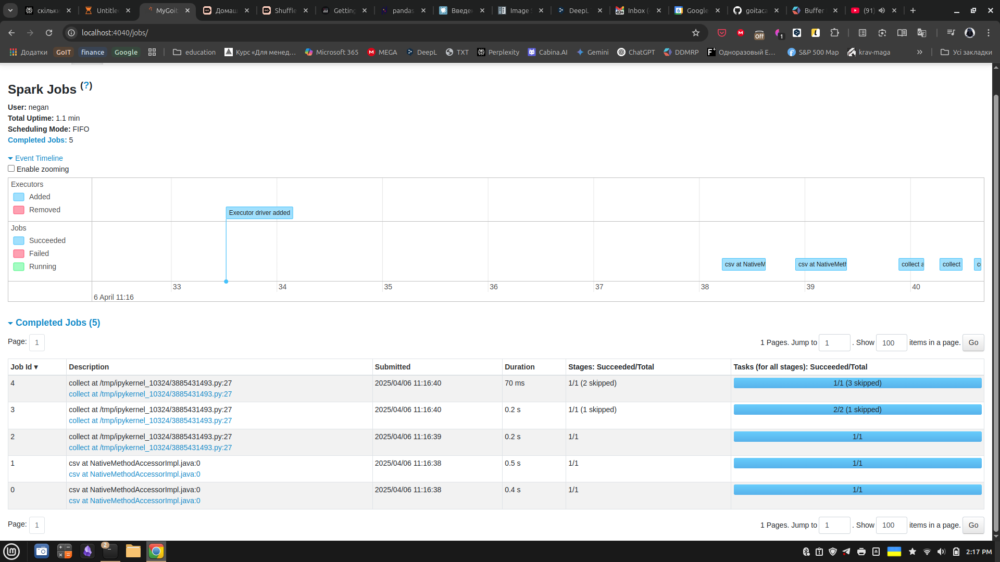

1. Виконуємо першу частину завдання:

2. Виконуємо другу частину завдання:

Як бачимо, другий collect додає ще три jobs, як і першій (теж три). При цьому для кожного з обох collect друга та третя job мають пропущені (за рахунок оптимізації) stages.

3. Виконуємо третю частину завдання:

Як бачимо, завдяки кешуванню, результат відбору та групування виконався тільки раз, а подальші виводи використовували цей закешований результат, відповідно job #6 з другого завдання не виконувався.

